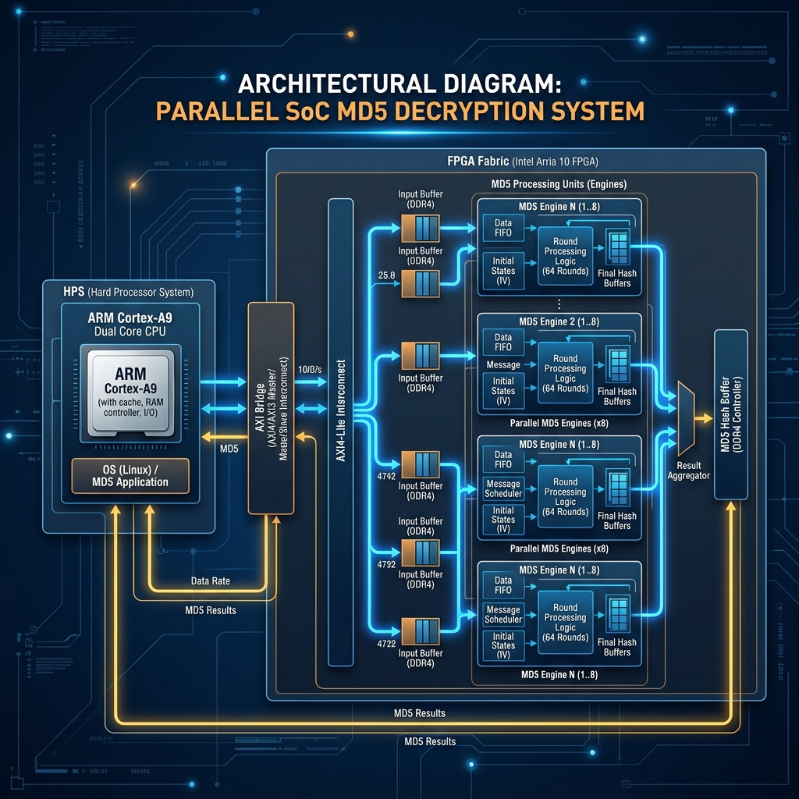
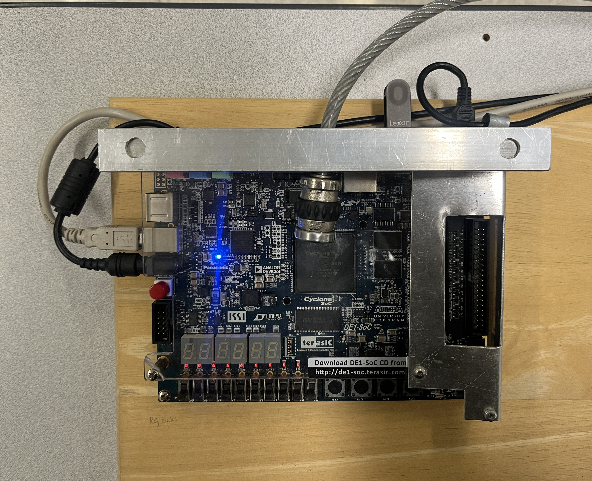

# HPS-FPGA Based MD5 Decryption SoC

*Figure 1: Physical implementation on the DE1-SoC board.*

### Hardware Components Legend:
*   **A: Cyclone V SoC** - The heart of the system, containing the Dual-core ARM Cortex-A9 (HPS) and the FPGA fabric.
*   **B: 7-Segment Displays** - Used to display MD5 status and hashing results.
*   **C: USB Blaster II** - Connection for programming the FPGA and debugging.
*   **D: HPS USB Port** - Used for Linux console access and data transfer.
*   **E: Push Buttons & Switches** - Manual controls for resetting or triggering MD5 operations.
*   **F: 12V DC Power** - Main power supply for the development board.
*   **G: Prototyping Mount** - Custom wooden and metal framing for secure lab testing.

## Project Overview
This project implements a high-performance **MD5 Decryption System** on the **Terasic DE1-SoC** platform. It leverages the tight integration between the **Hard Processor System (HPS)** (dual-core ARM Cortex-A9) and the **FPGA Fabric** (Intel/Altera Cyclone V) to accelerate MD5 hashing operations.

The system is designed to perform MD5 hashing in hardware, significantly outperforming software-only implementations by utilizing parallel processing units within the FPGA.

## Hardware Implementation
The physical system is built on the **Terasic DE1-SoC Development Board**, featuring an Altera/Intel Cyclone V SoC.

- **Mounted Setup**: The board is mounted on a custom prototyping base for stability during testing.
- **Peripheral Usage**:
    - **7-Segment Displays**: Used for status monitoring.
    - **HPS-FPGA Bridge**: Enables the ARM Cortex-A9 to interact with the MD5 hardware blocks.
    - **USB Connectivity**: Supports debugging and data transfer.

## System Architecture

### 1. Hardware (FPGA Fabric)
The FPGA implements the core MD5 hashing logic using a hierarchical VHDL design:
- **Chunk Cruncher**: The primary engine that processes 512-bit message blocks.
- **MD5 Unit**: A container that manages multiple chunk crunchers and their associated memory (ROMs for constants K and S, RAM for message data).
- **MD5 Group**: A top-level module that clusters multiple MD5 units to enable massive parallelism.
- **AXI Integration**: Custom IP cores interface with the HPS via the **AXI Lightweight Bridge**, allowing the ARM processor to control the engines and read back results.

### 2. Software (HPS - ARM Cortex-A9)
The software side is written in **C** and runs on the ARM processor:
- **Memory Mapping**: Uses `mmap` via `/dev/mem` to access FPGA registers from user space.
- **Parallel Loading**: Utilizes `pthreads` to simulate or manage parallel data loading into hardware engines.
- **Validation**: Includes a software-based MD5 implementation to verify the correctness of the hardware results.

## Key Features
- **Parallelism**: Hardware-level parallelism with multiple MD5 engines.
- **SoC Integration**: Efficient communication between ARM and FPGA using Memory Mapped I/O.
- **Performance**: High-throughput hashing suitable for cryptographic analysis or brute-force decryption tasks.
- **Extensibility**: The modular VHDL design allows for scaling the number of engines based on available FPGA resources.

## File Structure
- `md5-rtl/`: Contains the VHDL source files for the FPGA hardware accelerators.
- `md5/md5/`: The main Quartus Prime project files and Qsys/Platform Designer system definitions.
- `md5/md5/software/`: C source code for the HPS application.
- `SoC-Project.pdf`: Detailed project documentation and report.
- `architecture.png`: Visual overview of the system architecture.

## How to Run
1. **Hardware**: Open `MD5_project.qpf` in Quartus Prime, compile the design, and program the DE1-SoC board.
2. **Software**: Compile the C code in the `software/` directory (requires SoC EDS or a cross-compiler) and run the executable on the HPS (Linux).

---
*Developed as part of COE838: Systems-on-Chip Design.*
